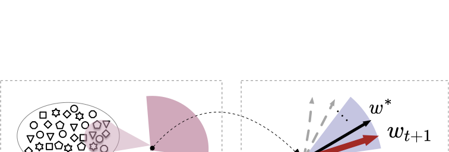

# FedEve: On Bridging the Client Drift and Period Drift for Cross-device Federated Learning

## Overview

FedEve is a novel approach for cross-device federated learning that addresses two key challenges: client drift and period drift. Our method uses a predict-observe framework with Bayesian filtering to allow these two types of drift to compensate for each other, leading to improved convergence and performance.

[Project Website](https://tao-shen.github.io/fedeve/) | [Paper](https://tao-shen.github.io/fedeve/static/pdfs/fedeve.pdf) | [GitHub](https://github.com/tao-shen/fedeve)


## Key Concepts

### Client Drift and Period Drift

In federated learning, two significant challenges arise from data heterogeneity:

- **Client Drift**: When clients perform multiple local updates, they can drift too far towards their local objectives, diverging from the shared optimization direction.

- **Period Drift**: Due to partial client participation in cross-device FL, the participating clients in each round may represent a data distribution different from the overall client population. This drift can be particularly harmful as data heterogeneity increases.

## The FedEve Method

FedEve is based on a predict-observe framework that:

1. Uses Nesterov momentum as a prediction function on the server side
2. Treats client updates as observations of the global update direction
3. Employs a Bayesian filter to integrate prediction and observation
4. Adaptively determines the interpolation coefficient based on the variance of both drifts



### Key Advantages

- Reduces the variance of model updates
- Requires no additional client storage or extra communication costs
- Introduces no additional hyperparameters to tune
- Outperforms alternatives on non-IID data in cross-device settings

## Research Contributions

1. Analysis of the impact of period drift and client drift in cross-device FL
2. A novel predict-observe framework incorporating a Bayesian filter to integrate server and client optimizations
3. The FedEve algorithm that combines prediction and observation through adaptive linear interpolation
4. Theoretical evidence and extensive empirical validation of our approach

## Citation

If you find this work useful for your research, please consider citing our paper:

```bibtex
@article{fedeve2023,
  title={FedEve: On Bridging the Client Drift and Period Drift for Cross-device Federated Learning},
  author={Shen, Tao and Li, Zexi and Zhu, Didi and Zhao, Ziyu and Wu, Chao and Wu, Fei},
  journal={arXiv preprint},
  year={2023}
}
```

## License

[MIT License](LICENSE)

## Contact

For questions or collaboration opportunities, please contact [author email].
